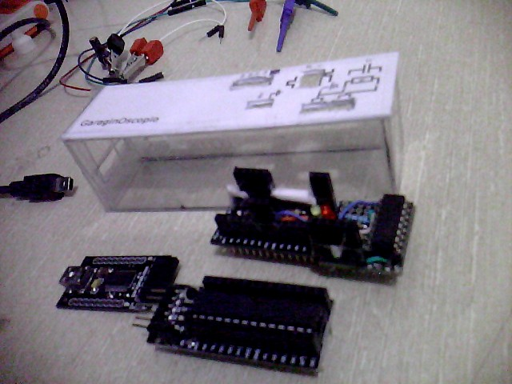
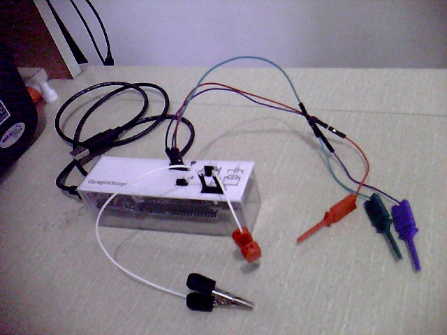

# Osciloscópio com Arduino e Processing

### Descrição

Osciloscópio de amostragem com 4 canais (tensões de 0 a 5V), com frequências até 3kHz.

Possui um gerador de sinal PWM e uma saída de onda quadrada.

Também pode, automaticamente, identificar o valor de resistor ou capacitor usando 3 escalas para melhor aproximação.

Foi usado o microcontrolador Garagino, mas é totalmente compatível com o Arduino (www.arduino.cc).

Usei a linguagem de programação "Processing" (www.processing.org) para criar o programa no computador.

Veja uma [demonstração]( https://www.youtube.com/watch?v=aw_kyDAiNak) no youtube.

### Um pouco de história!     (leitura opcional!)
Eu soube da existência do Arduino no início de 2015  e fiquei impressionado com a facilidade de criarmos projetos tanto na montagem dos componentes quanto na digitação do código. (eu já havia feito um TCC no Senai usando o PIC16F877a e MikroC, então posso fazer essa afirmação com propriedade).

Os Shields e as bibliotecas nos deixam livres dos códigos das entranhas do microcontrolador, e nos permite focar apenas na criação e funcionalidade do nosso projeto.

E o melhor de tudo?  É "Código Aberto"!

Comprei o kit Arduino no LabdeGaragem e um livro sobre o assunto. Me diverti muito aprendendo e criando as experiências.

Logo em seguida pensei que seria fácil criar um osciloscópio simples, pois eu estava precisando de um.

Tentei usar o Visual Basic e o C++, com os quais tenho alguma familiaridade, mas não ficou bom o traçado das curvas na tela.

Então em Abril de 2015 conheci o Processing, e percebi a facilidade e a capacidade para criar qualquer aplicativo. Foi o casamento perfeito!

Em Julho de 2015 conclui a minha primeira versão do osciloscópio que chamei de Garaginoscópio, pois fiz com o Garagino, que iria ficar melhor por ser fisicamente menor.

Com o tempo fui melhorando o layout e acrescentando novas funções, como um gerador de PWM e um medidor de resistor e capacitor.

### Capacidades do Osciloscópio

- Monitorar até 4 canais de tensão (0 a 5V).

- Consegue mostrar frequências até 3kHz.

- Estabiliza a onda na tela usando um "trigger" simples.

- Identifica a frequência da onda usando o melhor critério (quadrada ou senoidal)..

- Escalas: volts/divisão e tempo/divisão ajustadas individualmente para cada canal.

- Ferramenta para medir tensão e tempo em cada canal.

- Visualização combinada dos canais em XYZ.

- Gerador de sinal PWM.

- Medir valores de resistor ou capacitor em 3 escalas (automaticamente)

 
### O Osciloscópio
       

### O circuito no mini proto shield
 
 
 
### O circuito de leitura do resistor e capacitor
 

### O CI 74HC4052 (multiplexador analógico)
 

### O programa em Processing
 

### Melhorias para o futuro

- Medir tensões 110/220 Vac

- Aumentar a capacidade da frequência usando microcontroladores mais poderosos.

- Usar conexão bluetooth para conectar o osciloscópio ao celular (Android)

### Finalizando

Eu gostei muito de desenvolver os programas e o hardware do osciloscópio.

Acredito que ele tenha um ótimo potencial para um produto mais profissional.

