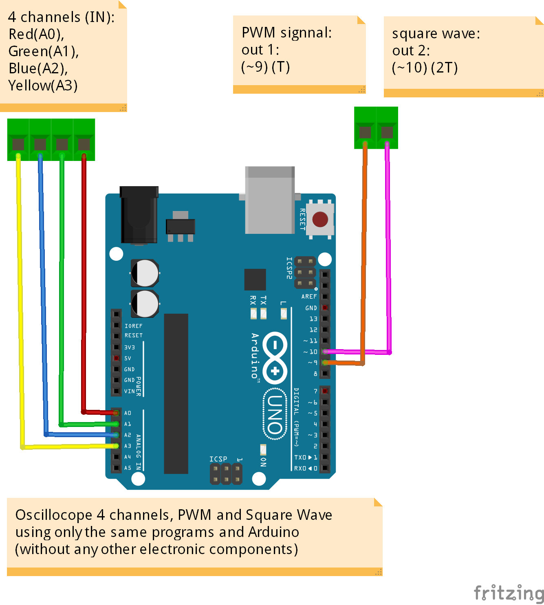
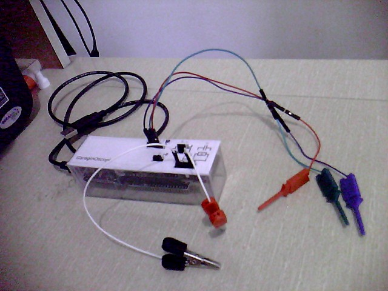

# Oscilloscope using Arduino and Processing

### Description

Sampling oscilloscope with 4 channels (voltages from 0 to 5V), with frequencies up to 3kHz.

It has a PWM signal generator and a square wave output.

It can also automatically identify the resistor or capacitor value using 3 scales for better approximation.

The Garagino microcontroller was used, but it is fully compatible with the Arduino (www.arduino.cc).

I used the programming language "Processing" (www.processing.org) to create the program on the computer.

See a [demo] (https://www.youtube.com/watch?v=aw_kyDAiNak) on youtube.

### Oscilloscope Capabilities

- Monitor up to 4 voltage channels (0 to 5V).

- Can display frequencies up to 3kHz.

- Stabilizes the wave on the screen using a simple trigger.

- Identify the frequency of the wave using the best criterion (square or sinusoidal).

- Scales: volts / division and time / division adjusted individually for each channel.

- Tool to measure voltage and time in each channel.

- Combined display of channels in XYZ.

- PWM signal generator.

- Measure resistor or capacitor values on 3 scales (automatically)

### For those who do not need to read values of Resistors and Capacitors (without electronic components)

You can have the oscilloscope functions, the PWM signal, and the Square Wave generator using only the programs (unchanged) and the Arduino.

### The Oscilloscope
       

